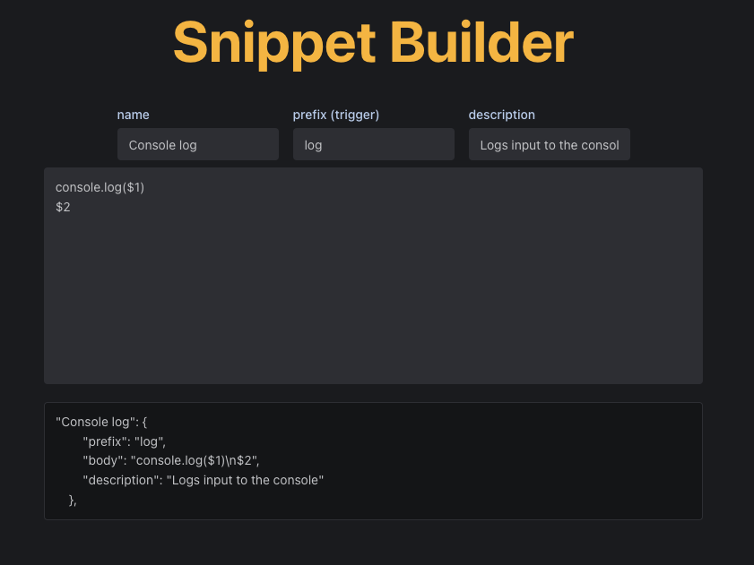

      

[Snippet Builder](https://snippet-builder.com/) is a simple and elegant app to create VS code snippets. It's a react app built with Next.js, Typescript, and hosted on [Vercel](https://vercel.com/). Visit and check it out!

# Motivation
I wanted a quick and easy way to generate VS Code snippets. I found one website that did this, but it's missing some features I wanted (mainly reverse edit snippets), so I created my own. 

